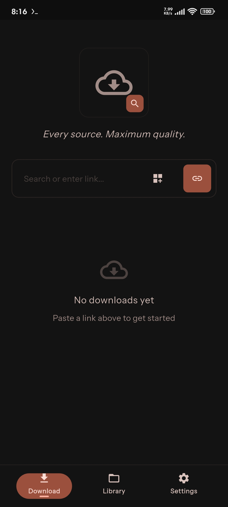
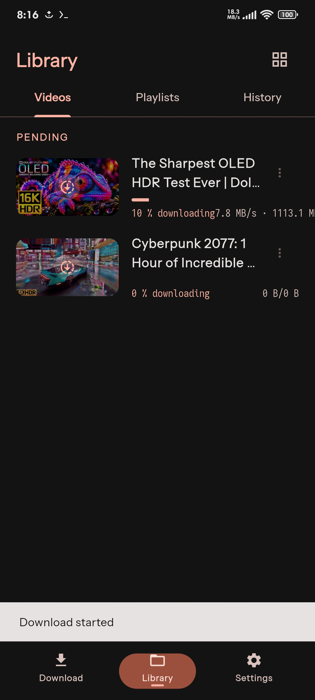
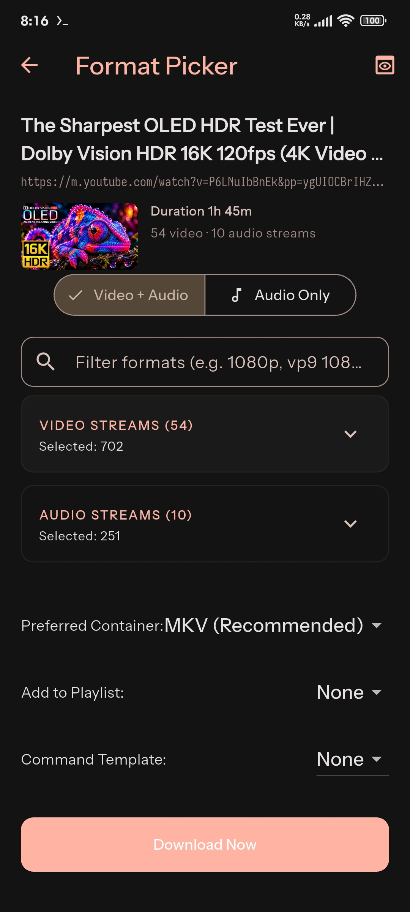
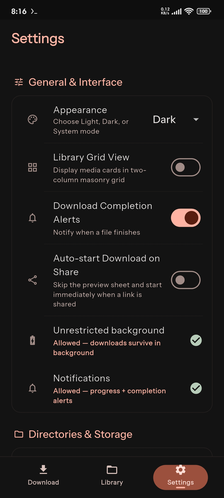
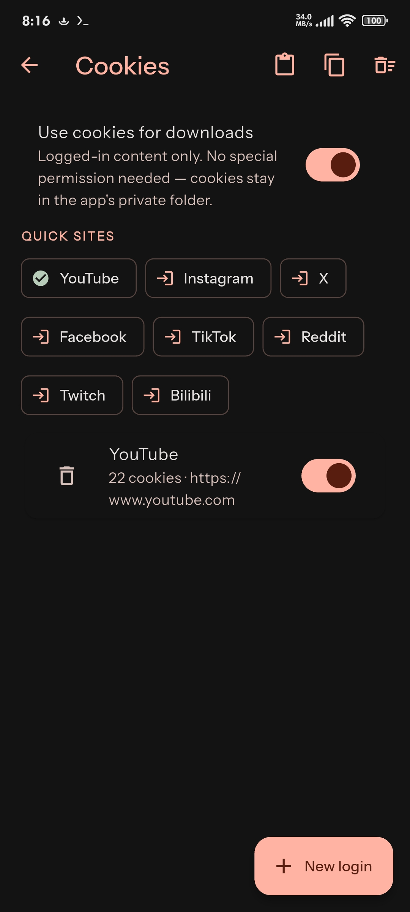
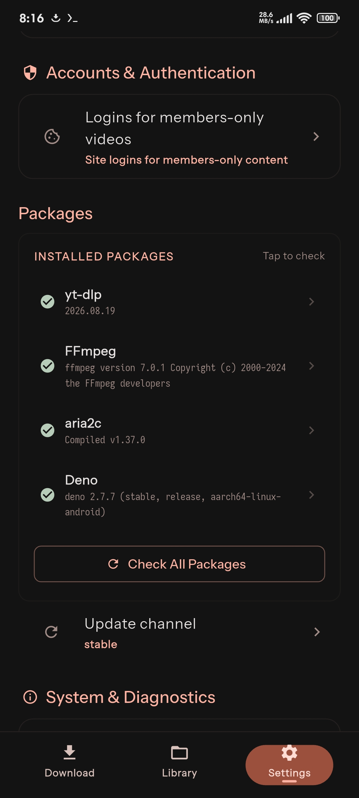

<div align="center">


# 🎬 TrueStream

### Download from 1,000+ platforms. Best quality. No ads. No accounts. No speed limits.

Built with **Flutter** + **Python (yt-dlp)** — one Dart codebase for **Android**, **Windows** & **Linux**.

[](https://flutter.dev)
[](https://dart.dev)
[](https://www.python.org)
[](https://github.com/yt-dlp/yt-dlp)
[-3DDC84?logo=android&logoColor=white)](https://developer.android.com)
[](https://www.microsoft.com/windows)
[](https://www.linux.org)
[](.github/workflows/verify.yml)
[](pubspec.yaml)
[](https://apps.obtainium.imranr.dev/redirect?r=obtainium://app/%7B%22id%22%3A%22com.theonly.truestream%22%2C%22url%22%3A%22https%3A%2F%2Fgithub.com%2FOnlyXianzo%2FTrueStream%22%2C%22author%22%3A%22OnlyXianzo%22%2C%22name%22%3A%22TrueStream%22%7D)

[✨ Features](#-features) · [🆕 What's New](#-whats-new--september-2026) · [🚀 Quick Start](#-quick-start) · [🏗 Architecture](#-architecture) · [📚 Docs](#-documentation) · [🤝 Contributing](#-contributing)

</div>

---

## 📲 Install & stay updated

**[➕ Add TrueStream to Obtainium](https://apps.obtainium.imranr.dev/redirect?r=obtainium://app/%7B%22id%22%3A%22com.theonly.truestream%22%2C%22url%22%3A%22https%3A%2F%2Fgithub.com%2FOnlyXianzo%2FTrueStream%22%2C%22author%22%3A%22OnlyXianzo%22%2C%22name%22%3A%22TrueStream%22%7D)**
— installs straight from GitHub Releases and keeps you updated automatically
(one tap + confirm, no account, no store).
First install [Obtainium](https://github.com/ImranR98/Obtainium/releases),
tap the link on your device, confirm — or in Obtainium: *Add App* → paste
`https://github.com/OnlyXianzo/TrueStream`.

### Which APK? (device & hardware variants)

> 💡 **Tested Hardware Coverage**: Verified across Android hardware tiers from modern 64-bit flagships down to low-end budget 32-bit devices (e.g. Samsung Galaxy A04e, low-memory ARM32 phones), Chromebooks/emulators (`x86_64`), and Linux desktops with self-contained preinstalled binaries.

| Variant | Architecture | Runtime | Target Hardware | 1-tap Obtainium | Direct APK |
|---|---|---|---|---|---|
| **arm64 + Deno** ✅ | ARM64-v8a | Deno | High-end & modern phones (default) | [Add arm64‑Deno](https://apps.obtainium.imranr.dev/redirect?r=obtainium://app/%7B%22id%22%3A%22com.theonly.truestream%22%2C%22url%22%3A%22https%3A%2F%2Fgithub.com%2FOnlyXianzo%2FTrueStream%22%2C%22author%22%3A%22OnlyXianzo%22%2C%22name%22%3A%22TrueStream%22%2C%22additionalSettings%22%3A%22%7B%5C%22apkFilterRegEx%5C%22%3A%5C%22arm64-deno%5C%22%7D%22%7D) | [⬇ arm64‑deno](https://github.com/OnlyXianzo/TrueStream/releases/download/v0.0.1/truestream-v0.0.1-arm64-deno.apk) |
| **arm64 + Node.js** | ARM64-v8a | Node.js | Modern phones, ≈40 MB smaller download | [Add arm64‑Node](https://apps.obtainium.imranr.dev/redirect?r=obtainium://app/%7B%22id%22%3A%22com.theonly.truestream%22%2C%22url%22%3A%22https%3A%2F%2Fgithub.com%2FOnlyXianzo%2FTrueStream%22%2C%22author%22%3A%22OnlyXianzo%22%2C%22name%22%3A%22TrueStream%22%2C%22additionalSettings%22%3A%22%7B%5C%22apkFilterRegEx%5C%22%3A%5C%22arm64-node%5C%22%7D%22%7D) | [⬇ arm64‑node](https://github.com/OnlyXianzo/TrueStream/releases/download/v0.0.1/truestream-v0.0.1-arm64-node.apk) |
| **armv7 + Node.js** | ARMeabi-v7a | Node.js | Low-end & budget 32-bit phones (e.g. Galaxy A04e) | [Add armv7‑Node](https://apps.obtainium.imranr.dev/redirect?r=obtainium://app/%7B%22id%22%3A%22com.theonly.truestream%22%2C%22url%22%3A%22https%3A%2F%2Fgithub.com%2FOnlyXianzo%2FTrueStream%22%2C%22author%22%3A%22OnlyXianzo%22%2C%22name%22%3A%22TrueStream%22%2C%22additionalSettings%22%3A%22%7B%5C%22apkFilterRegEx%5C%22%3A%5C%22armv7-node%5C%22%7D%22%7D) | [⬇ armv7‑node](https://github.com/OnlyXianzo/TrueStream/releases/download/v0.0.1/truestream-v0.0.1-armv7-node.apk) |
| **x86_64 + Deno** | x86_64 | Deno | 64-bit Android emulators & Chromebooks | [Add x86_64‑Deno](https://apps.obtainium.imranr.dev/redirect?r=obtainium://app/%7B%22id%22%3A%22com.theonly.truestream%22%2C%22url%22%3A%22https%3A%2F%2Fgithub.com%2FOnlyXianzo%2FTrueStream%22%2C%22author%22%3A%22OnlyXianzo%22%2C%22name%22%3A%22TrueStream%22%2C%22additionalSettings%22%3A%22%7B%5C%22apkFilterRegEx%5C%22%3A%5C%22x86_64-deno%5C%22%7D%22%7D) | [⬇ x86_64‑deno](https://github.com/OnlyXianzo/TrueStream/releases/download/v0.0.1/truestream-v0.0.1-x86_64-deno.apk) |
| **x86_64 + Node.js** | x86_64 | Node.js | 64-bit emulators & Chromebooks (smaller) | [Add x86_64‑Node](https://apps.obtainium.imranr.dev/redirect?r=obtainium://app/%7B%22id%22%3A%22com.theonly.truestream%22%2C%22url%22%3A%22https%3A%2F%2Fgithub.com%2FOnlyXianzo%2FTrueStream%22%2C%22author%22%3A%22OnlyXianzo%22%2C%22name%22%3A%22TrueStream%22%2C%22additionalSettings%22%3A%22%7B%5C%22apkFilterRegEx%5C%22%3A%5C%22x86_64-node%5C%22%7D%22%7D) | [⬇ x86_64‑node](https://github.com/OnlyXianzo/TrueStream/releases/download/v0.0.1/truestream-v0.0.1-x86_64-node.apk) |
| **universal** | All ABIs | Both | Universal multi-ABI fallback for any Android device | [Add universal](https://apps.obtainium.imranr.dev/redirect?r=obtainium://app/%7B%22id%22%3A%22com.theonly.truestream%22%2C%22url%22%3A%22https%3A%2F%2Fgithub.com%2FOnlyXianzo%2FTrueStream%22%2C%22author%22%3A%22OnlyXianzo%22%2C%22name%22%3A%22TrueStream%22%2C%22additionalSettings%22%3A%22%7B%5C%22apkFilterRegEx%5C%22%3A%5C%22universal%5C%22%7D%22%7D) | [⬇ universal](https://github.com/OnlyXianzo/TrueStream/releases/download/v0.0.1/truestream-v0.0.1-universal.apk) |

<!-- obtainium: on each release, bump the v0.0.1 segment in the direct-APK links above to the new pubspec version core. -->
Release assets are named `truestream-v<version>-<variant>.apk` (e.g.
`truestream-v0.0.1-arm64-deno.apk`), attached to tags like `v0.0.1`
and built by [`build.yml`](.github/workflows/build.yml).
Releases ship as stable GitHub Releases (not prereleases) so Obtainium's
defaults pick them up; each per-variant link above also pins Obtainium's APK
filter (`arm64-deno` / `arm64-node` / `armv7-node` / `x86_64-deno` / `x86_64-node` / `universal`) so updates always pull the
same variant. Build flags per variant:
[`docs/building.md`](docs/building.md#release-variants-apk-size--js-runtime).

---

## 📖 What is TrueStream?

TrueStream is a **privacy-first media downloader** that pulls video & audio from
**1,000+ sites** (YouTube, Twitch, Twitter/X, Bilibili, podcasts & more) at the
**maximum available quality**, then merges, tags and organizes it for you.

| Principle | How we honor it |
|---|---|
| 🕵️ **Anonymous by default** | No account, no telemetry, no ads. Cookies & logins are 100% optional. |
| ⚡ **Fast** | aria2c parallel fragments (up to 16×), native DASH handling, threaded engine. |
| 🧠 **Smart** | Tiered codec ladder (AV1 → VP9 → H264), per-site profiles, presets, SponsorBlock. |
| 🛡️ **Resilient** | Classified errors with one-tap recovery, resume broken downloads, auto engine updates. |
| 📱 **Native** | Zero-install Android binaries, foreground keep-alive, share-intent, Kotlin callbacks. |

---

## ✨ Features

### 📥 Downloading
- 🎯 **Maximum-quality ladder** — AV1 → VP9 → H264 cascade with quality ceiling (up to 4K) and muxed-stream support for non-YouTube sites.
- 📚 **Batch & playlists** — whole channels, Playlist Selection screen (entry multi-select, reverse/shuffle, unavailable-entry marking), multi-URL batch importer with clipboard support.
- 🗂️ **Download queue** — FIFO engine queue (default 2 concurrent, 1–5 configurable in Settings), queued status on cards, enforced at every entry point.
- 🎛️ **Per-download controls** — overflow menu per item: redownload, audio re-fetch, delete (file + history), per-download logs.
- ⏱️ **Section cutting** — FFmpeg-only `--download-sections` syntax (`*10:15-20:00`), no extra runtime needed. Invalid specs warn-and-skip, never fail.
- 🔁 **DB-driven resume & recovery** — SQLite schema v3 execution snapshots (`configJson`, queue position, byte progress), 5s throttled heartbeat, automatic startup recovery sweep in `DownloadNotifier`, safe `BootReceiver` reboot recovery without illegal background FGS start + fallback `.part` scan.
- 📦 **Download archive** — skip already-downloaded items, optional per-folder archives.
- 🔔 **Scheduling & background watchlists** — scheduled download windows + WorkManager `ObservedSourcesPollWorker` background periodic polling (Atom RSS tier 1 + flat extractor fallback) with SQLite schema v4 deduplication.
- 📈 **Speed sparklines & smoothed ETA** — dual-stage EMA speed ($\alpha=0.3$) and ETA ($\alpha=0.15$) smoothing, 60-sample ring buffer, zero-dependency `DownloadSparkline` painter embedded in active download cards.

### 🎨 Media & metadata
- 🖼️ **Thumbnails, chapters, metadata** — embed thumbnail (with `writethumbnail` fix), split chapters, add metadata in canonical yt-dlp PP order.
- 💬 **Real subtitle embedding** — `FFmpegEmbedSubtitle` post-processor (`--embed-subs` equivalent) with language picker, auto-subs toggle, sidecar control.
- ✂️ **SponsorBlock** — mark *and* cut sponsor/intro/outro/self-promo chapters (`ModifyChapters` after `EmbedSubtitle`, before `Metadata`).
- 🎞️ **In-app preview** — thumbnail + duration + stream counts in the Format Picker before you commit.

### 📱 Android-native (zero install prompts)
- 📦 **Bundled `ffmpeg` + `deno` in jniLibs** — fetched at build time from pinned `ytdlnis-packages` APKs (SHA-256 verified), resolved via `BinaryPackageManager`. No helper APKs, no `REQUEST_INSTALL_PACKAGES`, manifest stays `INTERNET` + capped storage only.
- 🔄 **Foreground keep-alive** — `dataSync`-type `DownloadService` with progress notification, `START_NOT_STICKY`, timeout handling. Survives screen-lock & activity death.
- ⚡ **Callback event delivery** — Kotlin `EngineEventListener.onEvent` replaces queue polling: yt-dlp hooks push straight to Flutter, no polling overhead / GIL lag. Desktop keeps the queue path unchanged.
- 📤 **Share intent** — share a URL from any app → choice bottom sheet (quality/settings before anything downloads); optional auto-start opt-in skips the sheet.

### 🔓 Access & bypass
- 🍪 **Cookie & session auth** — in-app WebView cookie capture (Netscape export) + per-site login flags for private/age-restricted content.
- 🔑 **PO Tokens + JS runtimes** — YouTube SABR/`n`-sig challenges solved via **Deno → Node → QuickJS** priority, `ejs:github` remote components, `yt-dlp-ejs` solver scripts. Allowlisted JS only.
- 🌍 **Geo & network controls** — geo-bypass, proxy, rate-limit, Wi-Fi-only, turbo mode, retries + fragment retries + sleep intervals.

### 🧰 Reliability & diagnostics
- 🩺 **Classified errors** — every failure maps to a typed code (`GEO_BLOCKED`, `RATE_LIMITED`, …) with `recoverable` + `suggests_vpn` flags and an **Error Recovery card** (one-tap fix, not a raw string).
- 📝 **Aggressive persistent logging** — buffered `AppLogger` (30 s flush, `app_logs.txt` mirror, instant flush on ERROR/FATAL) + Python `RotatingFileHandler` (`server_logs.log`) + traced IPC middleware.
- 🛰️ **GitHub auto-report** — search-based dedup reporter (Flutter + `github_notifier.py`) so duplicate crash issues aren't filed twice.
- 📊 **Diagnostics & Logs screen** — troubleshooting flow, live log stream viewer (color-coded, filter by level/tag/search/source, tap-to-expand, export), engine/bootstrap status cards.
- 🔍 **Per-download logs** — tap any download (queue card, history row, overflow menu) for its own log, live and after completion.

### ♿ Accessibility & theming
- ✅ **WCAG 2.2 AA** — semantic labels, 48×48 touch targets, full TalkBack/VoiceOver support.
- 🎨 **Earth & Ethos theme** — `TrueStreamColors` tokens (no hex literals), Material 3 light/dark, Instrument Sans body + Iosevka Charon mono.

---

## 🆕 What's New — September 2026

Based on the latest commits on `main`:

| Area | Change |
|---|---|
| 📦 Android binaries | `ffmpeg`/`deno` ship **inside our own jniLibs** (`packages.gradle.kts`, SHA-256 pinned). `BinaryPackageManager` resolves + probes them; toolchain downloads **fail closed** on Android. Zero install prompts. |
| 🔄 Keep-alive | New `DownloadService` (`dataSync` foreground service) — ongoing progress notification, explicit start/stop, `onTimeout` handling. DB resume is the tracked follow-up. |
| ⚡ Event path | Replaced `startProgressPolling` with a **Kotlin `onEvent` callback** into Python (R8-safe `EngineEventListener`). Fixed the 7→8-arg `set_paths`/`deno_path` misalignment. |
| 🟢 JS runtimes | Full **Deno/Node/QuickJS** support (`_configure_js_runtime`, `remote_components=ejs:github`). Research doc: [`docs/JS_RUNTIMES_ANDROID_RESEARCH.md`](docs/JS_RUNTIMES_ANDROID_RESEARCH.md). |
| 💬 Subtitles | **Real embed fix** — `FFmpegEmbedSubtitle` PP in canonical order (EmbedSubtitle → ModifyChapters → Metadata). Plus FFmpeg-only `download_sections` cutting. |
| 🔍 Re-audit fixes | `updatetime` (not ignored `no_mtime`), `writethumbnail` for `EmbedThumbnail`, SponsorBlock cutter ordering, `filesize_bytes` on terminal events, `suggests_vpn` on errors, desktop `ERROR_CANCELLED` → `cancelled`. |
| 📝 Logging | Buffered persistent logs both sides + global error handlers + navigation/Riverpod/engine observers + GitHub dedup reporter + live viewer tab. |
| 🔒 Security | **Zip-Slip/Tar-Slip hardened extraction**, `java.android` bridge detection (Termux-safe), allowlisted JS hashes, aria2c arg validation (1–16 chunks, speed regex), no DASH/HLS via aria2c (CVE-2026-50574), `0600/0700` temp dirs, aware-UTC datetimes, 99 % progress cap (terminal `finished` vs stream events). |
| 📋 Playlists | Generator guards, expanded video IDs, storage sanitization. |
| 📤 Share sheet | Shared links open a choice bottom sheet (engine-ready gated) instead of auto-starting; auto-start kept as opt-in. Format Picker header always shows thumbnail + duration + stream counts. |
| 🗂️ Queue & controls | FIFO engine queue (default 2, 1–5 in Settings) on Android + desktop; per-item overflow menu (redownload, audio re-fetch, delete, logs); native completion/error alerts; permission rationale flow. |
| 🔍 Per-download logs | `download_id` correlation end-to-end; log bottom sheet from queue, history, or overflow menu; bounded retention. |
| 🖼️ Thumbnails | Sidecar-preserving embed, `thumbnail_path` on finish events, history DB v2, local-first Library rendering. |
| 📋 Playlist selection | New selection screen (multi-select, reverse/shuffle, unavailable marking) wired to the tested engine contract. |
| 📈 Speed sparkline & ETA | Dual-stage EMA speed smoothing ($\alpha=0.3$) and ETA smoothing ($\alpha=0.15$), 60-sample ring buffer, zero-dependency `DownloadSparkline` painter embedded in active download cards. |
| 🔁 DB-driven resume | SQLite schema v3 execution snapshots (`configJson`, `queuePosition`, `attempts`, byte counters), 5s heartbeat, startup recovery sweep in `DownloadNotifier`, safe `BootReceiver` (`BOOT_COMPLETED` without direct FGS start). |
| ⏰ Background scheduler | Inexact `PeriodicWorkRequest` via WorkManager (`observed-sources-poll`, zero exact alarms), two-tier poll (Atom RSS first, Chaquopy fallback), SQLite schema v4 `seen_source_videos` deduplication ledger, auto-queueing to `pending`. |
| 🧪 CI | Fixed `flutter analyze` (181 cascading errors from `AppLogger` regex escapes) + Python `UnboundLocalError` (`deno_version=None` under pytest); `lintVital` disabled for AGP/Kotlin-script bug; `zip.so` stripping skipped. |
| 🎬 SABR/PO-Token | YouTube format-block resolution + aria2c DASH hardening (July). |

> Full history: `git log --oneline -30`

---

## 📱 Screens

| # | Screen | What it does |
|---|---|---|
| 1 | **Onboarding** | First-run tour → routes to AppShell |
| 2 | **Home** (queue) | URL input, active downloads, bootstrap status, error-recovery cards |
| 3 | **Format Picker** | Stream list, quality/codec/container choice, muxed badges |
| 4 | **Media Preview** | Downloaded-file thumbnail + metadata, open in system player |
| 5 | **Playlist Selection** | Playlist URL → entry multi-select, reverse/shuffle, unavailable marking |
| 6 | **Download Log Sheet** | Bottom sheet with one download's logs (live + history) |
| 7 | **Batch Download** | Multi-URL paste, list management, clipboard/file import dialog |
| 8 | **Library** | Completed downloads, grid/list toggle, search & filters |
| 9 | **Download History** | SQLite-backed history with search & filters |
| 10 | **Playlist Details** | Entry list, add/remove, unavailable-entry marking |
| 11 | **Settings** | Quality, network, aria2c, concurrency, subtitles, SponsorBlock, schedule, archive, templates, observed sources, auth, updates |
| 12 | **Download Presets** | 7 built-in + custom format/container/output-template presets |
| 13 | **Profile Editor** | Per-site extraction profiles (YouTube 1080p/4K, Podcast, FLAC, Opus, X/Twitter) |
| 14 | **Cookie WebView** | In-app browser → Netscape cookie export |
| 15 | **Diagnostics & Logs** | Troubleshooting flow, live log stream, export, engine status |
| 16 | **About** | Version, licenses, links |

Navigation: **AppShell** (`IndexedStack`, 3 tabs) — `BottomNavigationBar` on narrow (<600 px), `NavigationRail` on wide screens. Share-intent URLs arrive via `EngineService.sharedUrlStream`; the default path shows a choice bottom sheet gated on engine readiness (auto-start opt-in skips it).

### 📸 Real screenshots (v0.0.1-beta, 1080×2400 device captures)

| Home | Library (live downloads) | Format Picker (16K HDR) |
|---|---|---|
|  |  |  |

| Settings | Cookies & logins | Engine packages |
|---|---|---|
|  |  |  |

Full set (11 captures, incl. About, playlists, network, notification): [`assets/screenshots/`](assets/screenshots/).

---

## 🏗 Architecture

```
┌──────────────────────────────────────────────┐
│            Flutter UI (Riverpod)             │
│  Onboarding · Home · Library · Settings · …  │
└───────────────────┬──────────────────────────┘
                    │  EngineService (abstract)
      ┌─────────────┴──────────────┐
      │ Android: Chaquopy +        │
      │  MethodChannel/EventChannel│
      │  + Kotlin onEvent callback │
      │ Desktop: JSON-RPC stdio    │
      └─────────────┬──────────────┘
                    │
┌───────────────────▼──────────────────────────┐
│          Python Engine (yt-dlp API)          │
│  opts · formats · downloader · hooks · errors │
│  playlist · resume · bootstrap · po_token     │
│  logger · persistent · github_notifier        │
└──────────────────────────────────────────────┘
```

**Key design rules:** `YoutubeDL` class API only (never subprocess yt-dlp) ·
downloads in `threading.Thread` + cancel event · Riverpod for shared state
(never `setState`) · all binary paths via `set_paths()` · never combine
`merge_output_format` + `remux_video`.

### State (Riverpod)

`sharedPreferencesProvider` → `settingsProvider` → `engineProvider` →
`engineStatusProvider` · `downloadProvider` (subscribes `progressStream`) ·
`resumeProvider` · `playlistProvider` · `presetsProvider` · `batchProvider` ·
`downloadHistoryProvider` (SQLite) · `logBuffer/logEntries/logIngester` ·
`sharedUrlProvider` (share intent).

### IPC contract (v1.0)

| Channel | Direction | Purpose |
|---|---|---|
| `engine/bootstrap` | F → P | Verify binaries, manifest, yt-dlp version |
| `paths/set` | F → P | Inject data/output/cache dirs, binary paths, cookies (8 args incl. `deno_path`) |
| `download/start` | F → P | Spawn thread, return immediately |
| `download/cancel` | F → P | Set cancel `threading.Event` |
| `progress/stream` | P → F | Progress / post-proc / finished / error / cancelled events |
| `formats/get` | F → P | List streams for URL |
| `playlist/info` | F → P | Flat-extract entries |
| `search/query` | F → P | Search YouTube/SoundCloud queries via yt-dlp search extractors |
| `resume/scan` | F → P | Scan cache for `.part` files |
| `download/queue_status` | F → P | Parked queued IDs + active count + limit |
| `download/set_concurrency` | F → P | Set max concurrent downloads (1–5) |
| `download/clear_archive` | F → P | Clear download-archive (redownload-after-delete recovery) |
| `engine/update_check` | F → P | CDN re-check |
| `engine/set_update_channel` | F → P | stable / nightly / master |

Android transport: `MethodChannel com.theonly.truestream/engine` +
`EventChannel com.theonly.truestream/progress` + `intent/shared_url`.
Desktop transport: line-delimited JSON-RPC over stdin/stdout with UUID
correlation, 30 s timeout, auto-restart (≤3).

---

## 🧩 Tech Stack

| Layer | Technology |
|---|---|
| UI | Flutter 3.x (Impeller, 120 fps) · Dart 3.11 · Riverpod · Material 3 |
| Engine | Python 3.11 · yt-dlp (`YoutubeDL` API) · `yt-dlp-ejs` solver scripts |
| Android bridge | Chaquopy · Kotlin `MainActivity` · `BinaryPackageManager` · `DownloadService` |
| Desktop bridge | JSON-RPC over stdin/stdout (`DesktopEngineService`) |
| JS runtimes | Deno (bundled `.so` on Android / bootstrapped on desktop) · Node fallback · QuickJS (`python-quickjs`) |
| Media | FFmpeg (static / jniLibs) · aria2c (static, native only for DASH/HLS) |
| Persistence | SharedPreferences (settings/presets/playlists) · SQLite (history) |
| Fonts | Instrument Sans (body) · Iosevka Charon Mono |
| Tests | `flutter_test` · `pytest` (181 engine tests) |

### 🐍 Engine modules (16 + entry point)

| Module | Role |
|---|---|
| `paths` | Path store, `set_paths()`/`get_paths()`, PATH + site-packages injection |
| `config` | `DEFAULT_CFG` — format, subs, SponsorBlock, sections, network, playlist, auth, archive |
| `opts_builder` | `build_ydl_opts()` — aria2c guard, PP chain, subtitles, JS runtime, sections |
| `format_selector` | Tiered ladder AV1 → VP9 → H264 + ceilings + explicit IDs |
| `site_profiles` | 6 built-in per-domain profiles + CDN overrides |
| `downloader` | Threaded download, cancel event, `_active_downloads`, VPN hints, `filesize_bytes` |
| `hooks` | Progress + post-processor hooks → queue **or** Kotlin callback |
| `errors` | Typed hierarchy + `classify_error()` + `recoverable`/`suggests_vpn` |
| `formats` | No-download extraction → structured codec/resolution/bitrate + recommendations |
| `playlist` | Flat extraction, deleted-entry marking, generator guards, ID expansion |
| `po_token` | Allowlisted JS, `detect_js_runtime()`, QuickJS/Deno generation |
| `resume` | `.part` scan, 24 h expiry, `.info.json` URL recovery, sanitization |
| `bootstrap` | CDN manifest, SHA-256 gate, parallel ffmpeg/aria2c/deno fetch, uv venv, JS detect, jniLibs-aware |
| `logger` | 5-level structured logger, rotation, IPC queue, thread-local context |
| `persistent` | `RotatingFileHandler` (`server_logs.log`), traced IPC middleware |
| `github_notifier` | Crash dedup + auto-report pipeline |
| `__main__` | Desktop JSON-RPC loop, queue drain thread, CLI one-shots, `ERROR_CANCELLED` mapping |

---

## 🚀 Quick Start

```bash
git clone https://github.com/OnlyXianzo/TrueStream.git
cd TrueStream
flutter pub get
flutter run
```

> 📖 Full per-platform instructions, runtime deps & signing: **[docs/building.md](docs/building.md)**

### Engine dev setup

```bash
python3 -m venv .venv
source .venv/bin/activate          # Windows: .venv\Scripts\activate
pip install -r engine/requirements.txt
pip install -e engine/
pytest engine/tests/ -v            # 181 tests
```

---

## 🔨 Building

| Platform | Command | Output |
|---|---|---|
| Android | `flutter build apk --release` | `build/app/outputs/flutter-apk/app-release.apk` |
| Windows | `flutter build windows --release` + copy `engine/truestream_engine` into bundle | `build/windows/x64/runner/Release/` |
| Linux | `flutter build linux --release` + copy `engine/truestream_engine` into bundle | `build/linux/x64/release/bundle/` |

Android notes: `minSdk 24`, ABIs `arm64-v8a` + `x86_64`, Chaquopy bundles
CPython 3.11 + engine + `yt-dlp`/`curl_cffi` via pip block; `ffmpeg`/`deno`
arrive via `packages.gradle.kts` into jniLibs (pass `-PskipNativePackages` for
contributor builds without them). Desktop: `.venv` auto-detect → system
`python3` fallback; FFmpeg/aria2c/Deno bootstrapped at runtime (SHA-256 gated).

CI: [`verify.yml`](.github/workflows/verify.yml) runs `flutter analyze` +
`flutter test` + `pytest` on every push/PR to `main`;
[`build.yml`](.github/workflows/build.yml) builds all three platforms on manual dispatch.

---

## 🧪 Testing

```bash
flutter analyze          # must be zero-error (0 issues found)
flutter test             # 262 widget + unit tests (test/)
pytest engine/tests/ -v  # 309 engine tests
```

Coverage: config · errors · format ladder · opts (incl. subtitle-PP order,
sections, aria2c validation, JS runtime) · paths · playlists (generators, IDs,
sanitization) · downloader (cancel, VPN hints, filesize) · hooks (99 % cap,
`pp_key` stages) · bootstrap extraction (Zip/Tar-Slip) · packages (bundled
`.so` fallback) · structured logger · scheduler checks & feed parsing.

---

## 🔒 Security & Privacy

- ✅ Zip-Slip / Tar-Slip hardened extraction (absolute paths, `..`, null bytes, symlinks/devices rejected; `filter="data"` where available).
- ✅ In-app Android detection via `java.android` bridge (Termux-safe, not `ANDROID_DATA` sniffing).
- ✅ JS allowlist — only SHA-256-approved challenge stubs execute; Deno invoked without bogus permission flags.
- ✅ aria2c args clamped (`-x1..16`, speed regex) and **never** used for DASH/HLS (native downloader instead).
- ✅ Temp dirs `0700`, checksum-or-fail downloads, no silent unverified fetches, aware-UTC datetimes.
- ✅ No account / telemetry / ads. Cookies & logins opt-in. Binaries auditable (pinned SHAs).

---

## 🩺 Troubleshooting

| Symptom | Fix |
|---|---|
| YouTube fails / SABR / `n`-sig | Check **Diagnostics → engine status**: `js_runtime` should be `deno`/`quickjs`. Re-run bootstrap; desktop needs network for Deno fetch. |
| FFmpeg missing on Android | Contributor build without `-PskipNativePackages`? Rebuild with packages, or set a custom FFmpeg path in Settings. |
| Slow fragments | Enable **aria2c** in Settings (Wi-Fi), raise chunks (≤16). DASH/HLS always use native downloader by design. |
| Stuck at 99 % | By design — 99 % cap reserves terminal `finished`. If stuck, check **Live Logs** for the PP stage (merge/embed/chapters). |
| Resume not finding files | Only `.part` + `.info.json` < 24 h old in the cache dir are candidates. |
| Needs logs | **Settings → Diagnostics & Logs → Export** (`app_logs.txt` + `server_logs.log`). |

Deeper guides: [`docs/troubleshooting.md`](docs/troubleshooting.md) ·
[`docs/JS_RUNTIMES_ANDROID_RESEARCH.md`](docs/JS_RUNTIMES_ANDROID_RESEARCH.md)

---

## 📚 Documentation

| Doc | Contents |
|---|---|
| [Architecture](docs/architecture.md) | Stack, layers, IPC contract, providers, data flow, performance |
| [Building](docs/building.md) | Prerequisites, clone/setup, per-platform builds, tests, CI |
| [Features](docs/features.md) | Full capability catalog with settings map |
| [Troubleshooting](docs/troubleshooting.md) | Symptom → fix table, log locations, FAQ |
| [JS Runtimes (Android)](docs/JS_RUNTIMES_ANDROID_RESEARCH.md) | Deno/Node/QuickJS/bgutil research + recommendation |
| [Contributing](docs/contributing.md) | Style, commits, branches, PRs, architecture rules |
| [Changelog](docs/CHANGELOG.md) | Release notes distilled from commit history |
| [Accessibility audit](docs/testing/ACCESSIBILITY_AUDIT.md) | WCAG 2.2 findings & remediation |
| [Performance audit](docs/testing/PERFORMANCE_AUDIT.md) | Frame-rate methodology |
| [DMCA / Copyright](DMCA.md) | General-purpose-tool notice, user responsibility, takedown contact |

---

## 🤝 Contributing

1. Fork → branch from `main` (`feat/…`, `fix/…`).
2. Follow [Effective Dart](https://dart.dev/effective-dart) + PEP 8, Riverpod for shared state, `TrueStreamColors` (no hex), 48×48 targets + semantics.
3. One logical change per commit, [conventional commits](docs/contributing.md#commit-conventions).
4. Verify: `flutter analyze` · `flutter test` · `pytest engine/tests/ -v`.
5. PR to `main` with motivation + verification + platforms tested.

See **[docs/contributing.md](docs/contributing.md)** for the full checklist.

---

## 📄 License & Code of Conduct

TrueStream is open source and licensed under the [GNU General Public License v3.0](LICENSE) (GPL-3.0).

Please review our [Code of Conduct](CODE_OF_CONDUCT.md) before participating in or contributing to the project.

### ⚖️ Legal / DMCA

TrueStream is a **general-purpose tool** — you are responsible for your own
use and for complying with applicable law. Copyright holders: please send
takedown/infringement reports to **xianzo.help@gmail.com**. Full notice:
**[DMCA.md](DMCA.md)**.

<div align="center">

**TrueStream** — *your media, your device, your rules.* 🎬


</div>
